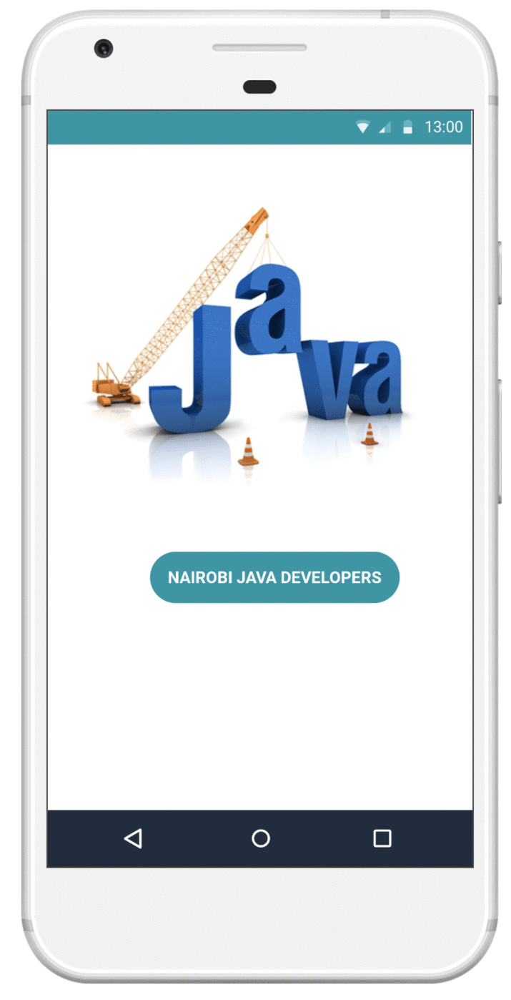

# NairobiJavaGeeks
Application to list all Java Developers in the Andela Nairobi Campus as provided by the GitHub API.

# Mockup Screens
The Mockup (wireframes) screens of this application can be found at this URL https://marvelapp.com/9h06d0h

> `Summary of the Mockups`

> `Application Mockups demo`

> `Application Splash Screen`

> `Java Developers List`

> `Developer Details`

> `Share Developer Profile Intent`

